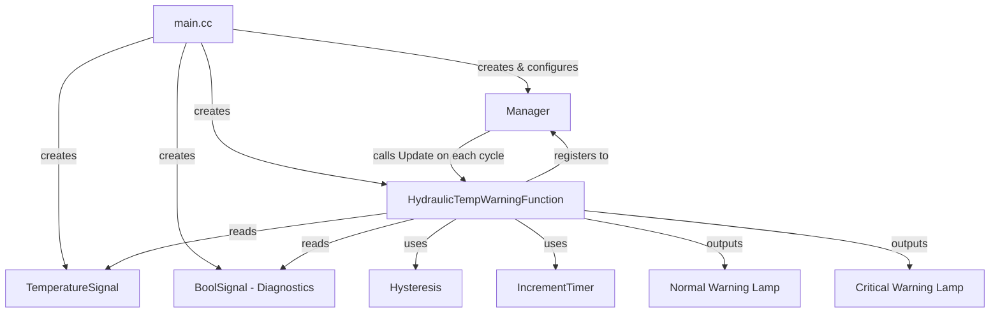
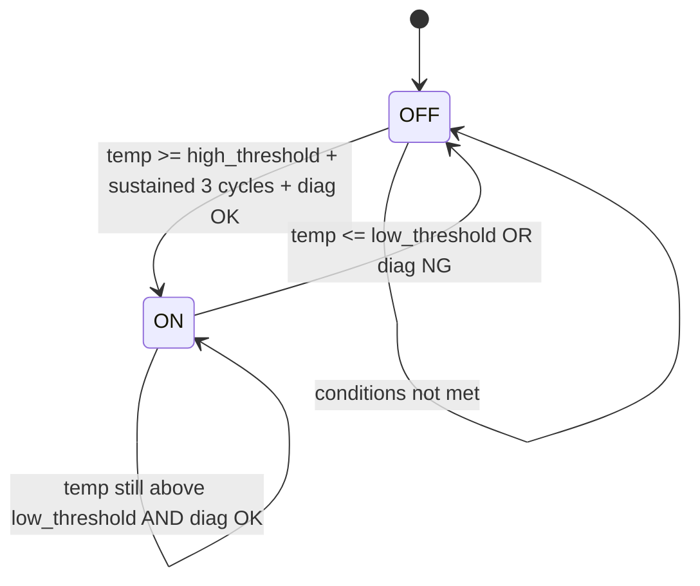

# Vehicle Monitoring System

A PC-based simulation of embedded control logic for **vehicle monitoring and warning systems**. This project demonstrates a modular, extensible framework commonly used in automotive and industrial embedded software.

## Architecture



## Warning Logic

### Two-Level Alert System

| Level | Condition | Behavior |
|-------|-----------|----------|
| **Normal** | Temp >= 95 C for 3 consecutive cycles, diagnostics OK | Normal lamp ON |
| **Critical** | Temp >= 100 C, regardless of diagnostics | Critical lamp ON (forced) |

### State Machine (Normal Warning)



### Key Design Decisions

- **Hysteresis**: Uses separate high (95 C) and low (85 C) thresholds to prevent lamp flickering when temperature oscillates near a single threshold.
- **Debounce Timer**: Temperature must exceed the threshold for 3 consecutive cycles before triggering, filtering out sensor noise.
- **Fail-safe (Critical)**: When temperature reaches critical level (>= 100 C), the system forces the warning lamp ON regardless of diagnostic status, ensuring safety even during communication failure.
- **Signal Validity**: If input signals are invalid (e.g., sensor disconnected), the system turns off lamps and marks output as INVALID.

## Project Structure

```
vehicle_monitoring_system/
+-- CMakeLists.txt
+-- main.cc                              # Entry point, test simulation
+-- src/
    +-- framework/
    |   +-- module_interface.h           # Abstract base class (pure virtual Update)
    |   +-- manager.h                    # Module scheduler (register + UpdateAll)
    +-- modules/
    |   +-- hydraulic_temp_warning_module.h   # Hydraulic oil temperature warning
    |   +-- hydraulic_temp_warning_module.cc  # Implementation
    |   +-- (engine_speed_warning_module)*    # Future: Engine speed monitoring
    |   +-- (coolant_temp_warning_module)*    # Future: Coolant temperature
    +-- signals/
    |   +-- signals.h                    # Signal template class with validity
    +-- utility/
        +-- hysteresis.h                 # Hysteresis comparator (reusable)
        +-- increment_timer.h            # Debounce timer (reusable)
```

*Planned modules marked with parentheses

## Build & Run

Requires **CMake 3.10+** and a C++11 compatible compiler.

```bash
cd vehicle_monitoring_system
mkdir build
cd build
cmake ..
cmake --build .
.\Debug\vehicle_monitoring_system.exe   # Windows
```

## Future Plans

- **Arduino Port**: Migrate logic to real hardware with ADC temperature sensing, GPIO LED control, and timer interrupts for scheduling.
- **FreeRTOS Integration**: Multi-task architecture with separate tasks for sensor reading, warning logic, and display.
- **Additional Modules**: Engine speed monitoring, system status dashboard ? demonstrating framework extensibility.
